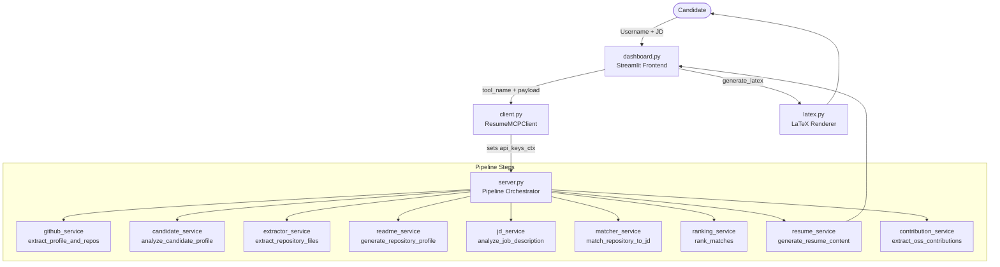
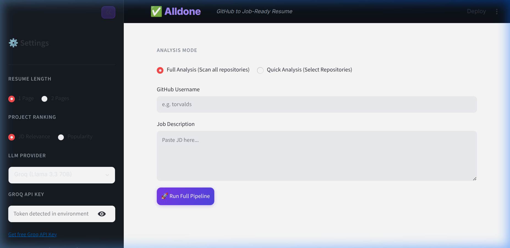

# 🎯 alldone — Developer Career AI Agent

> **Job Description → GitHub Portfolio → Tailored ATS Resume** — An AI-powered intelligence platform that parses your GitHub profile, matches real-world code against a job description, surfaces skill gaps, and compiles a download-ready LaTeX resume.

[](https://python.org)
[](https://streamlit.io)
[](https://groq.com)
[](https://aistudio.google.com)
[](https://huggingface.co)
[](LICENSE)

---

## 🚨 Problem Statement
Software engineers spend hours manually curating their resumes for every single job application. This repetitive manual labor involves cross-referencing GitHub repositories to find relevant projects, rewriting summaries to include ATS-friendly keywords, and re-formatting LaTeX documents from scratch to match specific job descriptions.

## 💡 Solution Overview
**Developer Career AI Agent** automates the entire resume tailoring process. By analyzing a candidate's GitHub profile and a target Job Description (JD), the AI agent deterministically maps real-world code (ASTs, dependencies, READMEs) to the required skills. It then highlights skill gaps and instantly compiles a perfectly tailored, ATS-compliant LaTeX resume.

## ✨ Key Features
- **Evidence-Based Matching:** Only marks a skill as "matched" if it explicitly appears in the user's code, dependency files, or documentation.
- **Automated Skill Gap Analysis:** Highlights exactly which JD requirements are missing from the candidate's public repositories.
- **One-Click LaTeX Resume Generation:** Uses an LLM to generate highly concise, high-impact engineering bullet points and compiles them into a download-ready PDF.
- **Bring Your Own Key (BYOK):** Privacy-first architecture ensuring LLM keys are session-scoped and never stored.

## 🛠️ Technologies Used
- **Frontend:** Streamlit, Vanilla CSS (Glassmorphism)
- **Backend Orchestration:** Python, Model Context Protocol (MCP) concepts
- **AI / LLMs:** Groq (LLaMA 3.3 70B), Google Gemini 2.5 Flash, Hugging Face
- **Integrations:** GitHub REST API
- **Document Generation:** LaTeX

## 🎯 Target Users
- **Software Engineers & Developers:** Looking to automate and optimize their job application process.
- **Students & Interns:** Needing help translating their academic and personal GitHub projects into professional resume bullets.
- **Career Coaches:** Seeking tools to rapidly generate baseline tailored resumes for their clients.

---

## 🏗️ Architecture

The presentation layer (Streamlit dashboard) is fully decoupled from backend execution. All tool calls pass through a lightweight **MCP-style client/server** pair over plain Python function calls, with per-request API-key isolation via `contextvars`.



---



---

## 📁 Project Structure

```
GithubResumeParser/
│
├── dashboard.py              # Streamlit UI — sidebar, tabs, state management, LaTeX preview
├── client.py                 # ResumeMCPClient — routes tool calls, injects API keys via contextvars
├── server.py                 # Pipeline orchestrator — pure Python functions per pipeline step
├── latex.py                  # LaTeX resume renderer (ATS Classic / Modern / Research themes)
├── style.css                 # Custom glassmorphic dark-mode CSS for Streamlit
├── requirements.txt          # Python dependencies
│
├── models/                   # Pydantic data schemas (type-safe DTOs)
│   ├── candidate.py          # CandidateProfile, CandidateDashboardData
│   ├── job_description.py    # JobDescriptionProfile
│   ├── match_result.py       # MatchResult, SkillMatch, OverallSkillGap
│   └── repository.py         # Repository, RepositoryMetadata, RepositoryFiles, RepositoryProfile
│
├── providers/                # LLM provider abstraction layer
│   ├── base.py               # LLMProvider abstract base class
│   ├── __init__.py           # get_provider() factory function
│   ├── groq_provider.py      # Groq — LLaMA 3.3 70B, exponential-backoff retry
│   ├── gemini_provider.py    # Google Gemini 2.5 Flash, retry-after parsing
│   └── huggingface_provider.py # HuggingFace InferenceClient — Qwen 2.5 72B + Mistral fallback
│
├── services/                 # Business logic — one concern per file
│   ├── llm_service.py        # call_llm() — thin dispatch to providers/
│   ├── github_service.py     # extract_profile_and_repos() — builds CandidateProfile + Repository list
│   ├── candidate_service.py  # analyze_candidate_profile() — LLM skill/domain inference from raw repos
│   ├── extractor_service.py  # extract_repository_files() — concurrent file fetch + deterministic tech extraction
│   ├── readme_service.py     # generate_repository_profile() — LLM README understanding → RepositoryProfile
│   ├── jd_service.py         # analyze_job_description() — LLM JD structured extraction
│   ├── matcher_service.py    # match_repository_to_jd() — evidence-based LLM scoring + post-processing
│   ├── ranking_service.py    # rank_matches(), compute_overall_skill_gap()
│   ├── resume_service.py     # generate_resume_content() — bullets, summary, skills section
│   └── contribution_service.py # extract_oss_contributions() — external merged PRs → resume entries
│
└── utils/                    # Shared utilities
    ├── keys.py               # api_keys_ctx — contextvars-based per-session key isolation
    ├── constants.py          # GITHUB_API_URL, CACHE_DIR, IMPORTANT_FILES list
    ├── github_api.py         # Low-level GitHub REST v3 calls (disk-cached)
    ├── dependency_parser.py  # Deterministic parsers for 15 file formats
    ├── technology_normalizer.py # Canonical name map (torch → PyTorch, cv2 → OpenCV, etc.)
    ├── cache.py              # Disk-based JSON cache with TTL + @disk_cache decorator
    └── parser.py             # extract_json_from_llm() — robust JSON extraction from LLM output
```

---

## 🔬 Module Deep Dive

### `server.py` — Pipeline Orchestrator
The central coordinator. Exposes six plain Python functions that are called by `client.py`:

| Function | Description |
|---|---|
| `extract_github_metadata(username, token, model_choice)` | Fetches GitHub profile + all non-fork repos; runs LLM candidate profile analysis; returns `dashboard` + `raw_repos`. |
| `build_repository_profiles(username, raw_repos, selected_repo_names, model_choice, token)` | For each selected repo: checks disk cache → fetches files → runs LLM README analysis → caches result. |
| `analyze_jd(jd_text, model_choice)` | Calls `jd_service` to extract structured `JobDescriptionProfile` from raw JD text. |
| `match_repositories(repo_profiles, jd_profile, raw_repos, model_choice)` | Scores each repo against the JD; ranks results; computes overall skill gap. |
| `extract_oss(username, model_choice, token)` | Fetches user's merged PRs in external repos and formats them as resume contributions. |
| `generate_resume(profile_dict, selected_repo_profiles, jd_profile_dict, user_instructions, match_results, model_choice, oss_contributions)` | Writes LLM bullets, professional summary, and aggregates a full skills section. |

### `client.py` — `ResumeMCPClient`
A thin routing wrapper. The `call()` method:
1. Collects API keys from the payload **or** environment variables.
2. Sets them into `api_keys_ctx` (a `contextvars.ContextVar`) — **isolated per request, never global**.
3. Dispatches to the correct `server.py` function by `tool_name`.
4. Resets the context variable in a `finally` block to prevent key leakage between sessions.

### `models/` — Pydantic Schemas

| Model | Key Fields |
|---|---|
| `CandidateProfile` | `username`, `bio`, `programming_languages`, `frameworks`, `tools_and_platforms`, `databases`, `cloud_technologies`, `ai_ml_technologies`, `primary_domains` |
| `CandidateDashboardData` | `profile`, `most_used_languages`, `top_repositories` |
| `JobDescriptionProfile` | `role`, `domain`, `required_skills`, `preferred_skills`, `programming_languages`, `technologies`, `tools`, `frameworks`, `libraries`, `methodologies`, `ats_keywords` |
| `RepositoryMetadata` | `name`, `stars`, `forks`, `topics`, `languages`, `default_language`, `archived`, `is_fork` |
| `RepositoryFiles` | `readme`, `detected_files`, `file_contents`, `detected_technologies` |
| `RepositoryProfile` | `one_line_summary`, `key_features`, `architecture_patterns`, `primary_skills`, `frameworks`, `libraries`, `resume_bullets`, `impact` |
| `MatchResult` | `overall_score`, `matched_skills`, `missing_skills`, `evidence` (dict), `confidence` |
| `OverallSkillGap` | `matched_skills`, `missing_skills` (list of `SkillMatch`), `suggested_projects` |

All models include a `sanitize` validator that converts `"N/A"`, `"none"`, `"null"` strings to empty lists to prevent Pydantic parse errors from LLM output.

### `providers/` — LLM Abstraction Layer

All providers implement the `LLMProvider` abstract base:
```python
class LLMProvider(ABC):
    def generate(self, sys_prompt: str, user_prompt: str, temperature: float = 0.1) -> str: ...
```

| Provider | Model | Retry Strategy |
|---|---|---|
| `GroqProvider` | `llama-3.3-70b-versatile` | Up to 3 retries, exponential backoff (15s base). Daily token limit detected and surfaced as a clear error. |
| `GeminiProvider` | `gemini-2.5-flash` | Up to 3 retries. Parses `retry in Xs` from the 429 response to use the exact server-suggested wait time. |
| `HuggingFaceProvider` | `Qwen/Qwen2.5-72B-Instruct` → fallback `mistralai/Mistral-7B-Instruct-v0.3` | Token optional (anonymous free tier). Falls back to smaller model on first error; retries on 429. Strips accidental markdown fences from output. |

The factory `get_provider(model_choice: str)` in `providers/__init__.py` maps the UI dropdown label to the correct class.

### `services/` — Business Logic

#### `github_service.py` — `extract_profile_and_repos()`
- Calls `get_user()` and `list_user_repos()` (both disk-cached).
- Skips empty repos (`size == 0`) and forks.
- Returns a `CandidateProfile` + list of `Repository` objects.

#### `candidate_service.py` — `analyze_candidate_profile()`
- Sends up to 50 repo summaries (name, description, languages, topics) to the LLM.
- Infers `primary_domains`, `programming_languages`, `frameworks`, `databases`, `cloud_technologies`, `ai_ml_technologies`, LinkedIn/portfolio URLs.
- Updates and returns the enriched `CandidateProfile`.

#### `extractor_service.py` — `extract_repository_files()`
Fully **deterministic** (no LLM):
1. Fetches language breakdown from GitHub API.
2. Concurrently fetches up to 25 important files (see `IMPORTANT_FILES` in `constants.py`) using `ThreadPoolExecutor(max_workers=8)`.
3. Calls `dependency_parser.parse_all_files()` on all fetched content.
4. Adds GitHub topics and language names as additional signals.
5. Normalizes all detected tech names via `technology_normalizer.normalize_list()`.

#### `readme_service.py` — `generate_repository_profile()`
- Combines README text, dependency file snippets, detected technologies, and repo metadata into a single LLM prompt.
- Merges deterministic `detected_technologies` with the LLM's `primary_skills` (deterministic data first, deduplicated).
- Output fields: `one_line_summary`, `project_purpose`, `problem_solved`, `key_features`, `architecture_patterns`, `resume_bullets`, `impact`, full tech stack breakdown.

#### `jd_service.py` — `analyze_job_description()`
- Extracts only **concrete, verifiable** technical requirements from a JD.
- Enforces `soft_skills = []` — soft skills are never passed to the matching engine.
- Sanitizes any boolean `True`/`False` values from LLM output to prevent Pydantic errors.

#### `matcher_service.py` — `match_repository_to_jd()`
Three-stage matching pipeline:
1. **LLM Pass** — sends full repo profile + JD + README snippet; LLM returns `matched_skills`, `missing_skills`, `evidence`, `matched_domain`, `confidence`.
2. **Post-processing Rescue** — rescans the README and repo profile fields for skills the LLM incorrectly marked missing. Uses synonym expansion, singular/plural variants, and hyphen normalisation (`skill_matches_jd()`).
3. **Deterministic Scoring** — `calculate_overall_score()` computes a weighted score: Domain (40%) + Skill (30%) + Tech (15%) + Keyword (15%). Weights are normalised to 1.0 if some categories have no requirements.

#### `ranking_service.py`
- `rank_matches()` — sorts `MatchResult` list by `overall_score` descending.
- `compute_overall_skill_gap()` — aggregates matched skills across all repos; deduplicates by case-insensitive comparison; assigns `High` priority to every missing skill with a suggested learning project.

#### `resume_service.py` — `generate_resume_content()`
- Generates 3 bullet points + tech stack + one-liner per selected repo (one LLM call per repo).
- Generates an ATS-friendly professional summary (one additional LLM call).
- Aggregates skills into four categories — `Languages`, `Frameworks & Libraries`, `Tools & Platforms`, `Databases & Cloud` — from both the candidate profile and all selected repo profiles (additive, deduped).

#### `contribution_service.py` — `extract_oss_contributions()`
- Queries GitHub search API for merged PRs authored by the user in **other** repos.
- Filters out trivial contributions (typo fixes, docs, version bumps) using the LLM.
- Returns up to 3 formatted contribution entries for the resume.

### `utils/` — Shared Utilities

#### `keys.py`
```python
api_keys_ctx = contextvars.ContextVar("api_keys", default={})
```
A single `ContextVar` stores `{"GROQ_API_KEY": "...", "GEMINI_API_KEY": "...", "GITHUB_TOKEN": "...", "HF_TOKEN": "..."}` for the duration of one request. All providers read from this context — no global `os.environ` mutation.

#### `github_api.py`
Five functions (`get_user`, `list_user_repos`, `get_repo_file_content`, `get_repo_languages`, `get_user_merged_prs`) — all wrapped with `@disk_cache`. Includes a `_check_rate_limit()` helper that parses the `X-RateLimit-Reset` header and surfaces a human-readable error with the reset time.

#### `cache.py`
- `@disk_cache(namespace, ttl)` decorator — hashes function args to an MD5 key, stores JSON in `~/.alldone_cache/`.
- Default TTL: **24 hours**.
- `get_repo_profile_cache()` / `set_repo_profile_cache()` — explicit cache helpers used in `build_repository_profiles()` to skip redundant LLM calls on re-analysis.
- `clear_repo_cache(username)` and `cache_stats()` utility functions.

#### `dependency_parser.py`
Supports **15 file formats** — all deterministic, no LLM:

| File | Parser Function |
|---|---|
| `requirements.txt`, `environment.yml` | `parse_requirements_txt()` |
| `pyproject.toml` | `parse_pyproject_toml()` |
| `setup.py` | `parse_setup_py()` |
| `package.json` | `parse_package_json()` (deps + devDeps + peerDeps) |
| `Cargo.toml` | `parse_cargo_toml()` |
| `go.mod` | `parse_go_mod()` |
| `pom.xml` | `parse_pom_xml()` |
| `build.gradle` | `parse_build_gradle()` |
| `Gemfile` | `parse_gemfile()` |
| `composer.json` | `parse_composer_json()` |
| `pubspec.yaml` | `parse_pubspec_yaml()` |
| `Dockerfile` | `parse_dockerfile()` |
| `docker-compose.yml` | `parse_docker_compose()` |
| `Makefile` | `parse_makefile()` |
| `.github/workflows/` | `parse_github_actions()` (infers CI/CD tools) |

#### `technology_normalizer.py`
Maps 150+ raw package names to canonical display names (e.g. `torch` → `PyTorch`, `cv2` → `OpenCV`, `psycopg2` → `PostgreSQL`, `boto3` → `AWS`). `normalize_list()` also deduplicates by canonical name.

#### `parser.py` — `extract_json_from_llm()`
Four-stage JSON extraction from LLM responses: direct parse → ` ```json ``` ` fence extraction → first `{` to last `}` bounding → list fallback.

### `latex.py` — LaTeX Resume Renderer

`generate_latex(data, template)` assembles a complete compilable `.tex` document from the resume dict.

| Section | Function |
|---|---|
| Preamble + theme colour | `_preamble(theme_hex)` |
| Header with icons | `_header(profile)` — uses `fontawesome5` for email, GitHub, LinkedIn, portfolio |
| Professional Summary | `_summary(text)` |
| Technical Skills | `_skills(skills_dict)` — grouped rows |
| Key Projects | `_projects(projects)` — `\resumeProject{title}{url}{one_liner}{tech}` + bullet list |
| OSS Contributions | `_contributions(contributions)` |

Three built-in colour themes:
- **ATS Classic** (`#0053A0`) — safe blue, maximum ATS compatibility
- **Modern** (`#6D28D9`) — purple accent
- **Research** (`#065F46`) — dark green

All text is passed through `_esc()` which performs single-pass regex escaping of all LaTeX special characters (`\ & % $ # _ { } ~ ^`).

---

## 🛠️ Technology Stack

| Layer | Technology |
|---|---|
| Frontend | Streamlit + Custom Vanilla CSS (glassmorphic dark theme) |
| LLM Providers | Groq (LLaMA 3.3 70B), Google Gemini 2.5 Flash, HuggingFace (Qwen 2.5 72B) |
| GitHub Data | GitHub REST API v3 |
| Data Validation | Pydantic v2 |
| Caching | Disk-based JSON cache with MD5 keys + TTL (`~/.alldone_cache/`) |
| Key Isolation | Python `contextvars` (per-session, zero global mutation) |
| LaTeX Output | Custom template with `fontawesome5`, `hyperref`, `titlesec` |
| Concurrency | `concurrent.futures.ThreadPoolExecutor` (file fetching) |

---

## ⚡ Quick Start

### 1. Prerequisites
Python **3.10+** is required.

### 2. Install
```bash
git clone https://github.com/hillhack/GithubResumeParser.git
cd GithubResumeParser
pip install -r requirements.txt
```

### 3. Configure API Keys
Create a `.env` file in the project root:
```env
# Required — choose at least one LLM provider
GROQ_API_KEY=gsk_...          # https://console.groq.com  (free tier)
GEMINI_API_KEY=AIza...        # https://aistudio.google.com/app/apikey  (free tier)

# Optional — increase GitHub rate limit from 60 to 5,000 req/hr
GITHUB_TOKEN=ghp_...          # https://github.com/settings/tokens

# Optional — required for HuggingFace provider
HF_TOKEN=hf_...               # https://huggingface.co/settings/tokens
```

You can also enter keys directly in the **sidebar** of the running app — they are stored only in session memory and never written to disk.

### 4. Run
```bash
streamlit run dashboard.py
```
Open **http://localhost:8501** in your browser.

---

## 🖥️ User Flow

1. **Sidebar Setup** — Select your LLM provider (Groq / Gemini / HuggingFace). Paste optional API keys and a GitHub token.
2. **Enter GitHub Username** — Click **Load Profile** to fetch and display your profile stats and repository list.
3. **Select Repositories** — Choose which projects to include in the analysis (or run Full Analysis on all).
4. **Paste Job Description** — The JD is structured by the LLM into skills, tools, frameworks, methodologies, and ATS keywords.
5. **Run Analysis** — The pipeline matches every selected repo against the JD and ranks them.
6. **Results Tabs**:
   - **📄 Resume** — Preview and download the `.tex` source. Use *Custom Instructions* to regenerate with specific focus areas.
   - **📂 Projects** — Inspect each project's match score, matched/missing skills, and evidence sentences.
   - **🎯 Skill Gap** — Review the overall matched vs missing skills with suggested learning projects.

---

## 🔒 Security & Key Management

**alldone** uses a **Bring Your Own Key (BYOK)** model with `contextvars`-based isolation:

- Keys are set into a `ContextVar` at the start of each tool call and reset in a `finally` block.
- They are **never** written to disk, logged, or stored globally in `os.environ`.
- Each Streamlit session is isolated — keys from one session cannot leak into another.

```text
Current (BYOK) Architecture:
  User → API Key → contextvars → Provider → LLM

Production SaaS Architecture:
  User → SaaS Backend (server-side keys, proxy) → LLM
```

---

## 📝 License

Distributed under the MIT License. See `LICENSE` for more details.
