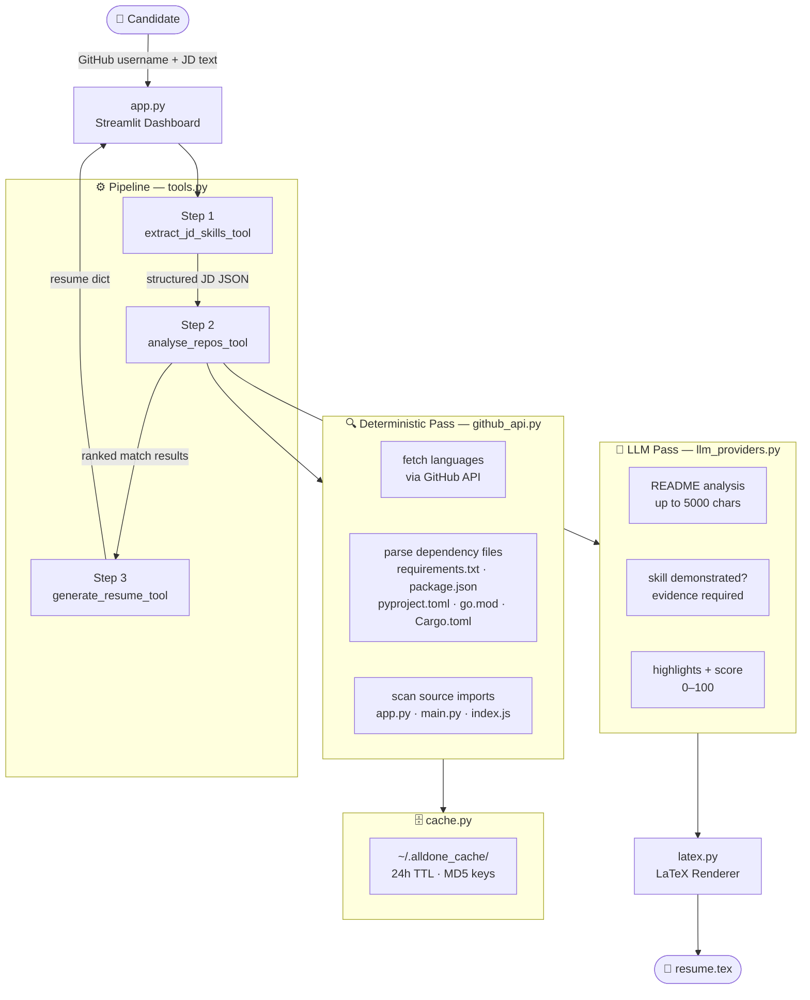

# ✅ Alldone — Developer Career AI Agent

> **GitHub Portfolio → Job Description → Tailored ATS Resume**
> An AI-powered platform that parses your GitHub profile, matches real code against a job description, surfaces skill gaps, and compiles a download-ready LaTeX resume.

[](https://python.org)
[](https://streamlit.io)
[](https://groq.com)
[](https://aistudio.google.com)
[](https://huggingface.co)
[](LICENSE)

---

## 🚨 Problem Statement

Software engineers spend hours manually tailoring their resumes for every job application — cross-referencing GitHub projects, rewriting summaries for ATS keywords, and reformatting LaTeX documents from scratch.

## 💡 Solution

**Alldone** automates the entire pipeline. It reads your GitHub profile, parses the job description with an LLM, deterministically verifies which skills you can actually prove from your code, and generates a precise, ATS-compliant LaTeX resume.

---

## ✨ Key Features

| Feature | Description |
|---|---|
| **Evidence-Based Matching** | Only marks a skill "matched" if it appears in code, dependency files, or documentation — no hallucinations |
| **Hybrid Analysis** | Deterministic keyword pass + LLM semantic README analysis, weighted 40/60 |
| **Skill Gap Report** | Shows exactly which JD requirements your portfolio is missing |
| **LaTeX Resume Generator** | Produces clean, download-ready `.tex` source with 3 colour themes |
| **Multi-Provider LLM** | Groq, Google Gemini, HuggingFace — bring your own free-tier key |
| **BYOK Security** | Keys are session-scoped via `contextvars` — never stored globally |
| **Disk Cache** | GitHub API responses cached 24h at `~/.alldone_cache/` — fast re-runs, no rate-limit waste |

---

## 🏗️ Architecture



### Score Formula

```
det_score  = (JD skills matched by repo keywords / total JD skills) × 100
llm_score  = LLM semantic score (0–100, from README analysis)

final_score = 0.4 × det_score + 0.6 × llm_score
```

---

## 📁 Project Structure

```
GithubResumeParser/
│
├── app.py              # Streamlit UI — topbar, sidebar, form, result tabs
│
├── tools.py            # Pipeline orchestrator — 3 tool functions
│     ├── extract_jd_skills_tool()   # JD → structured JSON via LLM
│     ├── analyse_repos_tool()       # Hybrid det+LLM repo scoring
│     └── generate_resume_tool()     # LLM resume generation + anti-hallucination filter
│
├── server.py           # MCP server — exposes tools as LLM-callable endpoints (FastMCP)
│     ├── extract_jd_skills()        # MCP tool wrapper
│     ├── analyse_repos()            # MCP tool wrapper
│     └── generate_resume()          # MCP tool wrapper
│
├── extractor.py        # JD extraction — prompt + parse_llm_json()
├── github_api.py       # GitHub REST client — repo fetch, enrichment, dep parsing
├── llm_providers.py    # LLM adapters — Groq · Gemini · HuggingFace + contextvars keys
├── latex.py            # LaTeX renderer — 3 themes (ATS Classic, Modern, Research)
├── cache.py            # Disk cache — get_cached / set_cached / 24h TTL
│
├── requirements.txt    # Runtime dependencies (Streamlit app)
├── .env                # Local API keys — never commit this
└── README.md
```

> **MCP Server:** `server.py` exposes `tools.py` functions as Model Context Protocol endpoints via [FastMCP](https://github.com/jlowin/fastmcp). Run it locally with `pip install fastmcp mcp && python server.py` to let an LLM agent dynamically choose and call tools. The Streamlit app (`app.py`) calls tools directly and does not depend on the MCP server.

---

## ⚡ Quick Start

### 1. Prerequisites

- **Python 3.10+**
- A free API key from at least one LLM provider (Groq recommended — fastest free tier)

### 2. Clone & Install

```bash
git clone https://github.com/hillhack/GithubResumeParser.git
cd GithubResumeParser
pip install -r requirements.txt
```

### 3. Configure API Keys

Create a `.env` file in the project root:

```env
# Required — pick at least one LLM provider
GROQ_API_KEY=gsk_...          # https://console.groq.com/keys  (free)
GEMINI_API_KEY=AIza...        # https://aistudio.google.com    (free)
HF_TOKEN=hf_...               # https://huggingface.co/settings/tokens

# Optional — raises GitHub rate limit from 60 → 5,000 req/hr
GITHUB_TOKEN=ghp_...          # https://github.com/settings/tokens
```

> You can also paste keys directly in the **sidebar** at runtime — they stay in memory only and are never written to disk.

### 4. Run

```bash
streamlit run app.py
```

Open **http://localhost:8501** in your browser.

---

## 🖥️ User Flow

1. **Settings sidebar** — Select LLM provider, paste API key, optionally add GitHub token
2. **Analysis Mode** — Choose *Full Analysis* (all public repos) or *Quick Analysis* (pick repos)
3. **Enter GitHub Username** — Fetches your public repository list
4. **Paste Job Description** — Extracted into structured skills, tools, languages, and domain requirements
5. **Generate Resume** — Pipeline runs in ~30–60s, results appear in 4 tabs:

| Tab | Contents |
|---|---|
| 📄 **Resume** | White-card HTML preview + LaTeX download |
| 🎯 **Skill Gap** | Overall matched/missing skills + per-repo breakdown |
| 🔍 **JD Analyser** | Structured breakdown of everything extracted from the JD |
| 📜 **LaTeX Source** | Raw `.tex` code + download button |

---

## 🔐 Security & Key Management

Alldone uses a **Bring Your Own Key (BYOK)** model with `contextvars`-based isolation:

```python
# llm_providers.py
groq_key_ctx   = contextvars.ContextVar("groq_key",   default="")
gemini_key_ctx = contextvars.ContextVar("gemini_key", default="")
hf_token_ctx   = contextvars.ContextVar("hf_token",   default="")
```

**Flow per tool call:**
1. Key is read from `os.environ` and pushed into the `ContextVar`
2. LLM call executes using the context-scoped key
3. `ContextVar` is **reset** in a `finally` block — key is gone from memory immediately

Keys are **never** written to disk, never logged, and cannot leak between sessions.

> ⚠️ Never commit your `.env` file. Add it to `.gitignore`.

---

## 🤖 Supported LLM Providers

### Groq (Recommended — Fastest Free Tier)
| Model | Speed | Quality |
|---|---|---|
| `llama-3.3-70b-versatile` | Fast | ⭐⭐⭐⭐⭐ |
| `llama-3.1-8b-instant` | Instant | ⭐⭐⭐ |

### Google Gemini
| Model | Notes |
|---|---|
| `gemini-1.5-flash` | Fast, cost-effective |
| `gemini-1.5-pro` | Higher quality |

### HuggingFace
| Model | Notes |
|---|---|
| `mistralai/Mixtral-8x7B-Instruct-v0.1` | High quality |
| `mistralai/Mistral-7B-Instruct-v0.3` | Efficient |

---

## 📦 Dependency File Support

The enrichment pipeline deterministically parses **10 file formats** — no LLM needed:

| File | Ecosystem |
|---|---|
| `requirements.txt` / `requirements-dev.txt` | Python (pip) |
| `pyproject.toml` | Python (PEP 517/518) |
| `setup.py` / `setup.cfg` / `Pipfile` | Python (legacy / pipenv) |
| `environment.yml` | Python (Conda) |
| `package.json` | JavaScript (npm / yarn) |
| `pom.xml` | Java (Maven) |
| `build.gradle` | Java / Kotlin (Gradle) |
| `Cargo.toml` | Rust |
| `go.mod` | Go |

Source files (`app.py`, `main.py`, `index.py`, `index.js`, `server.js`) are also scanned for raw `import` / `require()` statements.

---

## ⚙️ Tech Stack

| Layer | Technology |
|---|---|
| Frontend | Streamlit + Vanilla CSS (dark theme, fixed topbar) |
| LLM Providers | Groq (LLaMA 3.3 70B), Google Gemini 1.5, HuggingFace |
| GitHub Data | GitHub REST API v3 |
| Caching | Disk-based JSON cache with MD5 keys + 24h TTL |
| Key Isolation | Python `contextvars` (per-session, zero global mutation) |
| LaTeX Output | Custom template with `fontawesome5`, `hyperref`, `titlesec` |

---

## ⚠️ Known Limitations

- Repos with no README rely entirely on the deterministic pass (lower scores)
- LLM makes one API call per selected repo — selecting many repos increases cost and latency
- PDF compilation requires a local LaTeX installation (`pdflatex` or `tectonic`)
- GitHub rate limit is 60 req/hr without a token; add `GITHUB_TOKEN` for 5,000 req/hr

---

## 📄 License

MIT — see [LICENSE](LICENSE)
