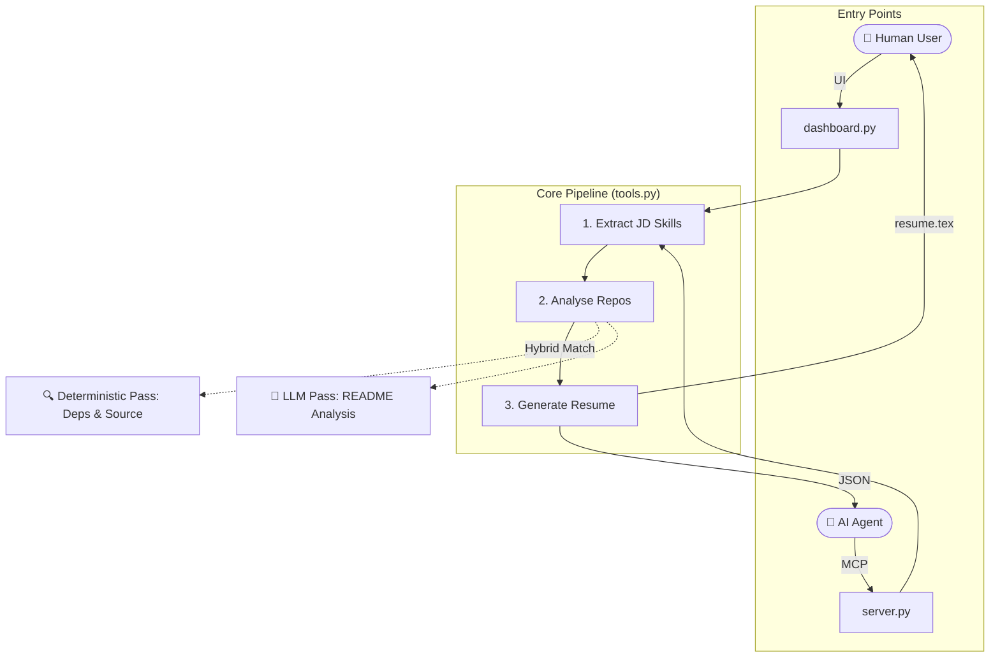

# ✅ Alldone — Developer Career AI Agent

> **GitHub Portfolio → Job Description → Tailored ATS Resume**

An AI-powered platform that aims to automatically analyze your GitHub profile, projects, and READMEs  and generate job-specific ATS-ready resumes.

[](https://python.org) [](https://streamlit.io) [](LICENSE)

## 📑 Index
- [🎯 User Capabilities](#-user-capabilities)
- [✨ Key Features](#-key-features)
- [⚡ Quick Start](#-quick-start)
- [🏗️ Architecture](#️-architecture)
- [🧩 Functionality Index](#-functionality-index)
- [⚙️ Tech Stack](#️-tech-stack)
- [📄 License](#-license)

## 🎯 User Capabilities
- **Download & Edit Resumes:** Generate `.tex` LaTeX resumes to download and manually tweak.
- **View Skill Matches & Gaps:** See exactly which job skills you have and which you are missing.
- **Choose Your LLM:** Select between Groq, Google Gemini, or Hugging Face to power the analysis.
- **View Repository Analysis:** See a detailed breakdown of what the application found across your analyzed GitHub repositories.
- **Agentic Integration:** Use via web app or FastMCP server for AI agents.

## ✨ Key Features
- **Evidence-Based Matching (Experimental):** Attempts to verify skills directly from source code, dependencies, and documentation.
- **Hybrid Analysis:** Combines deterministic keyword parsing with LLM semantic analysis.
- **Skill Gap Report (Beta):** Aims to highlight missing job description requirements based on your GitHub portfolio.
- **LaTeX Resume Generator (WIP):** Produces initial `.tex` output templates that may require manual tweaking.
- **BYOK Security:** API keys are scoped per-session (`contextvars`) and never stored.
- **MCP Ready:** Tools are exposed via FastMCP (`server.py`) for agentic integration.

## ⚡ Quick Start

### 1. Install
```bash
git clone https://github.com/hillhack/GithubResumeParser.git
cd GithubResumeParser
pip install -r requirements.txt
```

### 2. Configure Keys
Create a `.env` file (or paste keys directly in the app UI):
```env
# Require at least one LLM key (Groq recommended for speed)
GROQ_API_KEY=gsk_...
GEMINI_API_KEY=AIza...
HF_TOKEN=hf_...

# Optional: Raises GitHub API rate limit from 60 to 5,000 req/hr
GITHUB_TOKEN=ghp_...
```

### 3. Run
```bash
streamlit run dashboard.py
```
*(Open http://localhost:8501 in your browser)*

## 🏗️ Architecture

Alldone provides two separate entry points depending on your use case. Both interface with the same core pipeline (`tools.py`):

1. **For Human Users:** Run `dashboard.py` to use the Streamlit web interface.
2. **For AI Agents:** Run `server.py` to expose the pipeline as Model Context Protocol (MCP) endpoints for external LLMs.



## 🧩 Functionality Index
- **`dashboard.py`**: Streamlit web application providing the human-facing UI, configuration, and result visualization.
- **`server.py`**: FastMCP server exposing the core pipeline as endpoints for autonomous AI agents.
- **`tools.py`**: Core logic pipeline orchestrating JD skill extraction, hybrid repository analysis, and resume compilation.
- **`github_api.py`**: Manages GitHub interactions, fetching repositories, languages, READMEs, and parsing package dependencies.
- **`llm_providers.py`**: Abstraction layer integrating multiple LLMs (Groq, Google Gemini, HuggingFace).
- **`latex.py`**: Handles dynamic compilation of the parsed data into an ATS-friendly `.tex` format.
- **`extractor.py`**: Utility for safely parsing and extracting structured JSON data from raw LLM outputs.
- **`cache.py`**: Implements local disk-based caching with TTL to respect GitHub API rate limits and improve performance.

## ⚙️ Tech Stack
- **Frontend:** Streamlit + Vanilla CSS
- **LLMs:** Groq, Google Gemini, HuggingFace
- **Data:** GitHub API v3 with disk-based caching (24h TTL)
- **Core:** Python, FastMCP, LaTeX renderer

## 📄 License
MIT — see [LICENSE](LICENSE)
