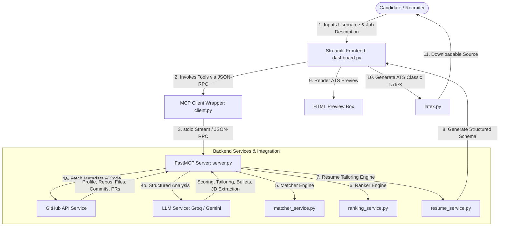

# 🎯 alldone: GitHub-to-ATS Resume Parser

> **Job Description → GitHub Portfolios → Tailored ATS Resumes** — An AI-powered intelligence platform that parses your GitHub profile, matches your real-world code against a job description, highlights skill gaps, and compiles an ATS-ready LaTeX resume. Built on a modular **Model Context Protocol (MCP)** architecture.

[](https://python.org)
[](https://streamlit.io)
[](https://github.com/jlowin/fastmcp)
[](https://groq.com)
[](https://aistudio.google.com)
[](LICENSE)

---

## 🚀 The Problem & The Solution

### The Problem: Repetitive Manual Labor
Every time a candidate of any field (software engineering, data science, DevOps, system administration, product management, research, etc.) applies for a new job, they must repeat the tedious, time-consuming manual process of tailoring their resume to match the specific Job Description (JD). This painful workflow includes:
* Manually cross-referencing your GitHub repositories to find which projects best align with the JD's requirements.
* Manually rewriting project summaries and descriptions to match target keywords and skills to pass ATS filters.
* Dealing with writer's block when trying to draft highly professional, action-verb bullet points highlighting technical choices.
* Wrangling LaTeX files or document formatting repeatedly to compile a clean, ATS-compliant page.

### The Solution: How alldone Automates this Labor
**alldone** completely automates this repetitive manual work:
1. **Targeted JD Parsing**: It extracts the exact required skills, preferred qualifications, and core domain from any pasted Job Description.
2. **Deep Codebase Inspection**: It scans your GitHub profile, repository structures, READMEs, source files, dependency configurations, and external merged Open Source PRs.
3. **Automated Relevance Scoring**: It uses LLM semantic matching to score and rank each project based on actual codebase evidence, highlighting where requirements are met.
4. **Instant ATS LaTeX Compiler**: It automatically drafts exactly 3 precise, punchy bullet points (describing *how* you solved the technical challenges) and compiles everything into a download-ready ATS Classic LaTeX template in seconds.

---

## 🏗️ Architecture Flow

The system is designed on top of **Model Context Protocol (MCP)**, completely separating the presentation layer from backend tool execution. The Streamlit frontend communicates with the backend exclusively via JSON-RPC stdio streams:



---

## 📁 Project Structure & Module Breakdown

```
GithubResumeParser/
├── dashboard.py               # Streamlit Frontend (layout, forms, tabs, state management)
├── client.py                  # Sync/Async MCP Client wrapper with auth fallbacks
├── server.py                  # FastMCP Server registering JSON-RPC tool endpoints
├── latex.py                   # Formatter converting JSON resume data into LaTeX
├── style.css                  # Custom styling for streamlit dark/glassmorphic interface
├── requirements.txt           # Declared python package dependencies
├── models/                    # Pydantic data schemas for type-safety
│   ├── candidate.py           # Candidate profile and dashboard representation
│   ├── job_description.py     # Structured Job Description profile
│   ├── match_result.py        # Project scoring, evidence mapping, and skill gap lists
│   └── repository.py          # Repository files, languages, and metadata
├── services/                  # Business logic engines
│   ├── candidate_service.py   # Synthesizes profile metadata into candidate overview
│   ├── contribution_service.py# Scrapes & structures external open-source PRs
│   ├── extractor_service.py   # Extracts readme, configuration, and source files
│   ├── github_service.py      # Fetches user details and full repository lists
│   ├── jd_service.py          # Extracts required and preferred skills from JDs
│   ├── llm_service.py         # LLM configuration (Groq/Gemini), prompt handling, retries
│   ├── matcher_service.py     # Performs strict evidence-based project scoring against JDs
│   ├── ranking_service.py     # Ranks matches and computes overall skill gap matrices
│   ├── readme_service.py      # Summarizes project architecture and technologies
│   └── resume_service.py      # Writes tailored summaries and concise bullet points
└── utils/                     # Supporting utilities
    ├── cache.py               # SQLite disk cache decorator to prevent rate-limit exhaustion
    ├── constants.py           # Core prompts, model mappings, and configuration defaults
    ├── github_api.py          # Low-level REST API requests to GitHub API
    └── parser.py              # Parsers for package.json, requirements.txt, and code
```

---

## 🛠️ Technology Stack

* **Frontend**: Streamlit + Custom Vanilla CSS (Modern glassmorphic layout)
* **Agent Protocol**: Model Context Protocol (FastMCP Client/Server over stdio)
* **LLM Providers**: 
  * **Groq** (LLaMA 3.3 70B) for high-speed, structured text parsing.
  * **Google** (Gemini 2.5 Flash) as a high-capacity fallback with a large free tier.
* **Data Core**: GitHub REST API v3 (fetching profiles, repos, config files, commits, PRs)
* **Storage / Cache**: Disk-based SQLite caching for HTTP and LLM payloads.
* **Exporter**: Raw copyable LaTeX source & `.tex` file output formatted for ATS scanners.

---

## ⚡ Quick Start

### 1. Prerequisites
Ensure you have **Python 3.10+** installed on your system.

### 2. Installation
Clone the repository and install all required libraries:
```bash
git clone https://github.com/hillhack/alldone.git
cd alldone
pip install -r requirements.txt
```

### 3. Configure API Credentials
Copy the example environment file:
```bash
cp .env.example .env
```
Fill in the credentials in your `.env` file:
* `GROQ_API_KEY`: Get your free key at [console.groq.com](https://console.groq.com/).
* `GEMINI_API_KEY`: Get your free key at [aistudio.google.com](https://aistudio.google.com/app/apikey).
* `GITHUB_TOKEN` *(Optional)*: Set your personal token to increase GitHub API rate limits from 60 to 5000 requests per hour. You can create one at [github.com/settings/tokens](https://github.com/settings/tokens).

### 4. Run the Platform
Start the Streamlit application:
```bash
streamlit run dashboard.py
```
Open **http://localhost:8501** in your browser.

---

## 🖥️ Platform User Flow

1. **Setup**: Select your preferred **LLM Provider** (Groq or Google Gemini). Provide a custom API key and GitHub Token if not already set in your `.env` file (direct link helpers are provided in the sidebar).
2. **Configure Analysis**:
   * **Full Analysis**: Automatically processes all repositories.
   * **Quick Analysis**: Fetches your repositories and allows you to select which projects you want to analyze and match.
3. **Execution**: Paste the target **Job Description**, choose your **Resume Length** (1-page or 2-page), and click **Run**.
4. **Results Tabs**:
   * **📄 Resume**: Preview the generated resume and copy/download the `.tex` source code. You can provide *Custom Instructions* in the expander at the top of the tab to regenerate and tailor it further (e.g. *"Focus on DevOps features"*).
   * **📂 Projects**: Inspect each project's rank, overall match %, matched/missing skills list, and direct evidence sentences extracted from the code.
   * **🎯 Skill Gap**: Review the compiled list of overall matched and missing skills with recommended learning pathways.

---

## 📝 License

Distributed under the MIT License. See `LICENSE` for more details.
